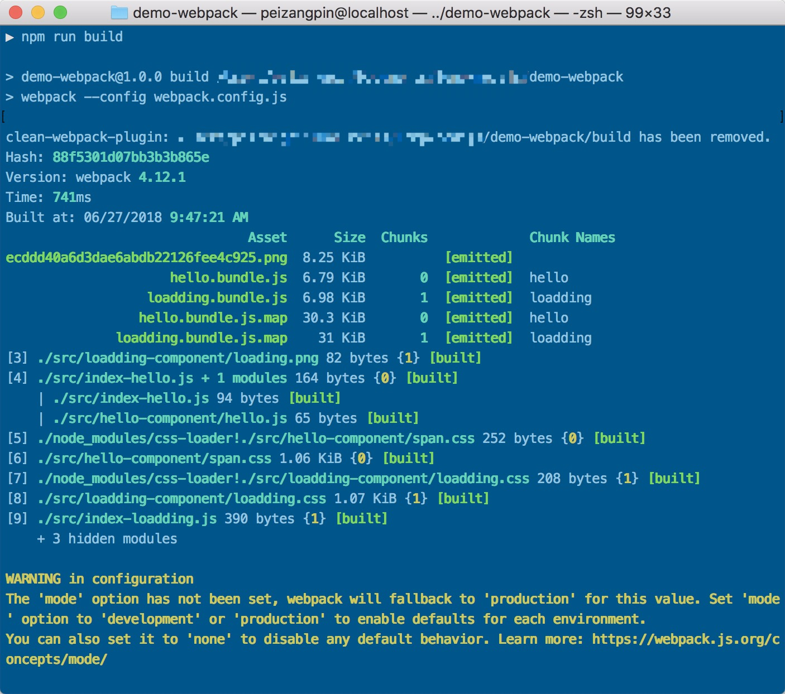
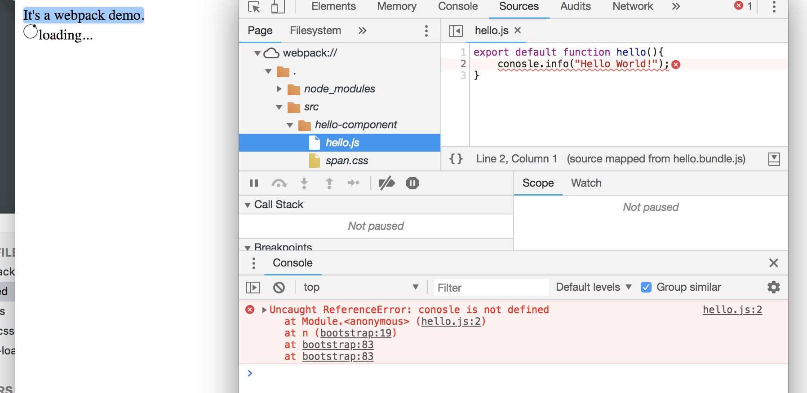
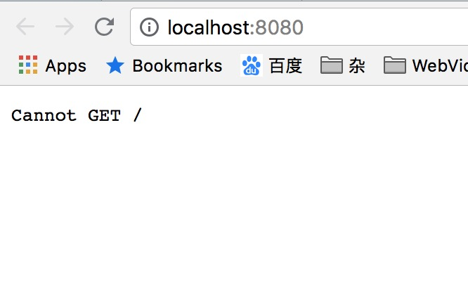
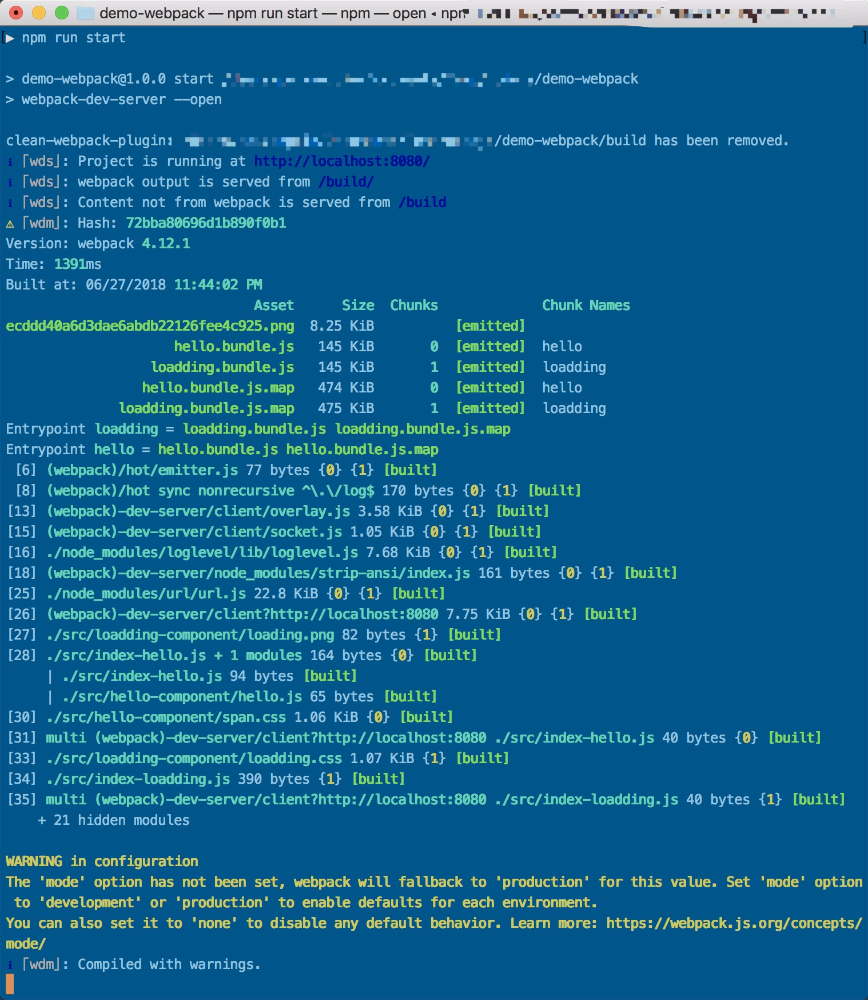
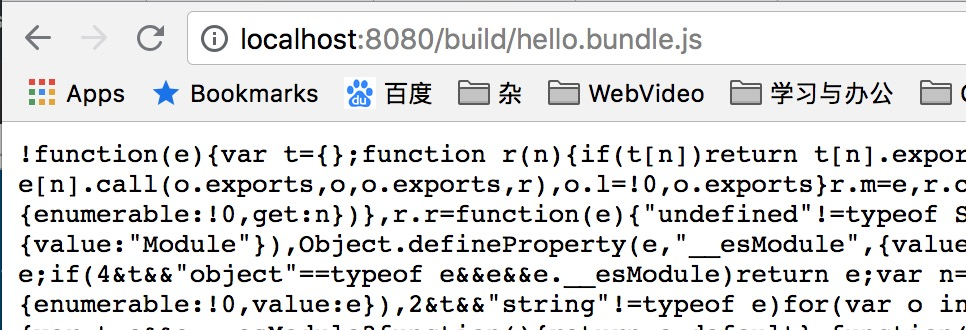
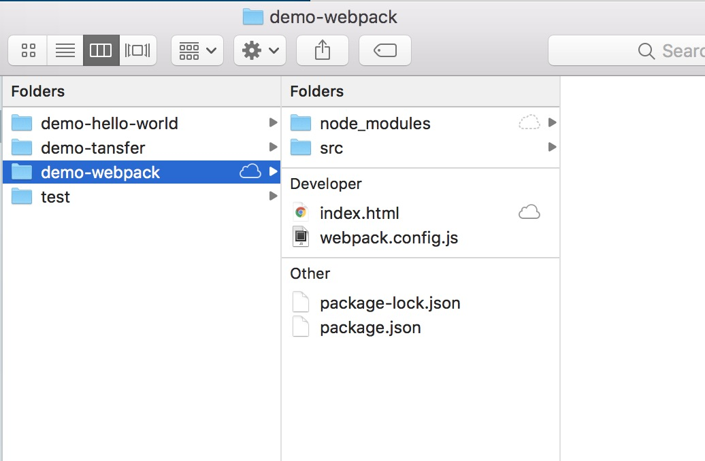
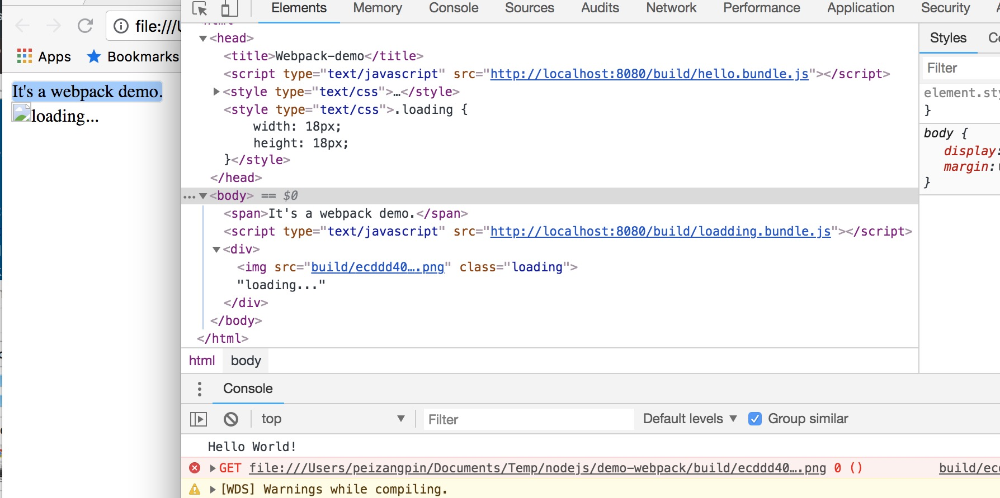
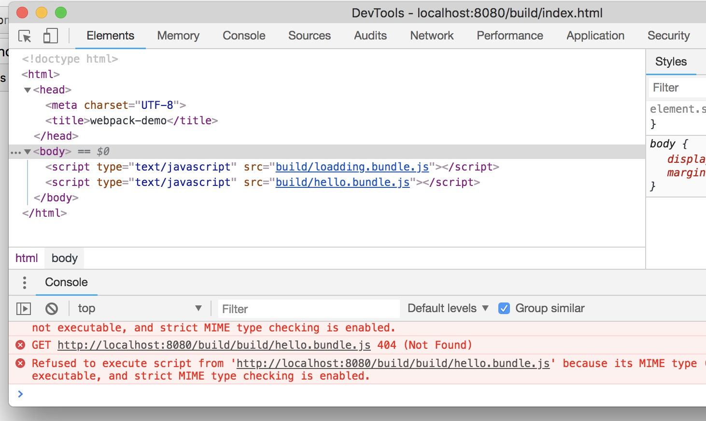
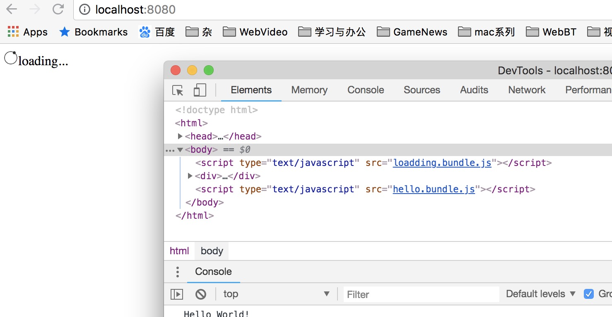

# 注意

**该篇内容只适合在开发中使用，请勿用在正式环境上！**


# 开发模式

> 该内容案例代码承接上一篇[[输出管理](./4-输出管理.md)]内容

webpack由于打包而虽然将前端组件解耦，方便每个组件的模块化，但是按照之前的方式不利于开发人员调试开发。

webpack打包过后的生成的js比如(`bundle.js`),由于是压缩js文件，在实际浏览器的**开发者工具**上面非常难以调试，且错误和异常很难排查。因此针对这个情况，webpack有针对开发环境的插件。


## 使用源码映射

>  如果读过[webpack初试](./2-webpack初试.md)章节最后。应该会对源码映射有一些印象。

JavaScript提供了源映射，它将编译后的代码映射回源码。该地址[[Source-Maps](http://blog.teamtreehouse.com/introduction-source-maps)]可以让你更加详细的了解源码映射。

让我们先开始用`inline-source-map`选项开始吧。

**webpack.config.js**

```diff
  const CleanWebPackPlugin = require('clean-webpack-plugin');
  
  module.exports = {
+ 	devtool: 'inline-source-map'
- 	devtool: 'source-map',
  	entry: {
  		loadding: './src/index-loadding.js',
  		hello: './src/index-hello.js'
  	},
      output: {
      	path: __dirname + '/build',
      	publicPath: 'build/',
      	filename: '[name].bundle.js'
  	},
  	module: {
  		rules: [
  			{ test: /\.css$/, use: [ 'style-loader', 'css-loader'] },
  			{ test: /\.(jpg|gif|png|svg)$/, use: ['file-loader'] }
  		]
  	},
  	plugins: [
  		new CleanWebPackPlugin('build')
  	]
  };
```

在这之后让我们制造一个明显的错误测试：

**src/hello-component/hello.js**

```diff
  export default function hello(){
- 	console.info("Hello World!");
+ 	conosle.info("Hello World!");
  }
```

运行`npm run build`



如上图，可以看到webpack能打包。

重新打开`index.html`查看测试结果：



可以看到控制台显示的错误能正常显示文件位置和行号。


## 选择开发工具

每次自己手动去执行`npm run build`编译代码会很麻烦

以下有几个开发工具能在代码变动的时候自动编译打包：

+ **webpack's watch mode**
+ **webpack-dev-server**
+ **webpack-dev-middleware**

### watch mode

你可以使用`webapck`指令附带的`--watch`参数来监视所有文件，只要其中一个文件更新了，就会重新编译。

接下来，我们在npm中项目设置webpack的监视模式

**package.json**

```diff
  {
    "name": "demo-webpack",
    "version": "1.0.0",
    "description": "",
    "private": true,
    "scripts": {
      "test": "echo \"Error: no test specified\" && exit 1",
+     "watch" : "webpack --watch",
      "build": "webpack --config webpack.config.js"
    },
    "keywords": [],
    "author": "",
    "license": "ISC",
    "devDependencies": {
      "clean-webpack-plugin": "^0.1.19",
      "css-loader": "^0.28.11",
      "file-loader": "^1.1.11",
      "style-loader": "^0.21.0",
      "webpack": "^4.12.1",
      "webpack-cli": "^3.0.8"
    }
  }
```

然后执行`npm run watch`启动。

这时候我们再改回代码

**src/hello-component/hello.js**

```diff
  export default function hello(){
+ 	console.info("Hello World!");
- 	conosle.info("Hello World!");
  }
```

这时候你再去点开`index.html`测试发现已经直接改变了。没有错误了。说明已经被编译了。

这个工具的唯一缺点就是还得去刷新浏览器查看变化。如果浏览器都能自动刷新的话就更好了。

### webpack-dev-server

`webpack-dev-server`这个工具能提供一个建议的web服务用来在线刷新。

先从**安装**开始吧

```shell
$npm install --save-dev webpack-dev-server
```

修改配置

**webpack.config.js**

```diff
  const CleanWebPackPlugin = require('clean-webpack-plugin');
  
  module.exports = {
  	devtool: 'source-map',
  	entry: {
  		loadding: './src/index-loadding.js',
  		hello: './src/index-hello.js'
  	},
+ 	devServer: {
+ 		contentBase: './build'
+ 	},
      output: {
      	path: __dirname + '/build',
      	publicPath: 'build/',
      	filename: '[name].bundle.js'
  	},
  	module: {
  		rules: [
  			{ test: /\.css$/, use: [ 'style-loader', 'css-loader'] },
  			{ test: /\.(jpg|gif|png|svg)$/, use: ['file-loader'] }
  		]
  	},
  	plugins: [ 
  		new CleanWebPackPlugin('build')
  	]
  };
```

`devServer`这个配置就是给`webpack-dev-server`使用的，`devServer.contentBase`是启动服务需要部署文件的目录

接下来我们增加`webpack-dev-server`的执行命令

**package.json**

```diff
  {
    "name": "demo-webpack",
    "version": "1.0.0",
    "description": "",
    "private": true,
    "scripts": {
      "test": "echo \"Error: no test specified\" && exit 1",
      "watch": "webpack --watch",
+     "start": "webpack-dev-server --open",
      "build": "webpack --config webpack.config.js"
    },
    "keywords": [],
    "author": "",
    "license": "ISC",
    "devDependencies": {
      "clean-webpack-plugin": "^0.1.19",
      "css-loader": "^0.28.11",
      "file-loader": "^1.1.11",
      "style-loader": "^0.21.0",
      "webpack": "^4.12.1",
      "webpack-cli": "^3.0.8",
      "webpack-dev-server": "^3.1.4"
    }
  }

```

现在，我们能使用`npm run start`来执行看看。



虽然成功启动了webpacka-dev-server服务，而且默认部署的服务器端口为`8080`，但是如上图所示，`Cannot GET /`报错，没有任何资源可以访问。

**问题解析**

查看`terminal`窗口

可以看到实际部署在内存中的文件都有哪些。我们看到有

+ ecddd40a6d3dae6abdb22126fee4c925.png
+ laodding.bundle.js
+ hello.bundle.js
+ hello.bundle.js.map
+ loadding.bundle.js.map

在浏览器地址栏输入`http://localhost:8080/build/hello.bundle.js`(其中`/build`路径为`wepack.config.js`配置中的`output.publicPath`)



可以看到`hello.bundle.js`文件确实部署进来了。



文件确实部署了，但是却没有生成`build`文件夹，其实，`webpack-dev-server`服务启动，部署的文件其实都是在内存中。

那么回到原来`Cannot GET /`问题的错误上，在`webpack.config.js`配置中`devServer.contentBase`配置的部署文件位置是`/build`但其实`/build`中没有`index.html`文件，因此无法在`webpack-dev-server`上访问`index.html`

但是我们可以修改`index.html`中的js引用路径

```diff
  <!DOCTYPE>
  <html>
  	<head>
  		<title>Webpack-demo</title>
- 		<script type="text/javascript" src = "hello.bundle.js"></script>
+ 		<script type="text/javascript" src = "http://loaclhost:8080/build/hello.bundle.js"></script>
  	</head>
  	<body>
  		<span>It's a webpack demo.</span>
  	</body> 
- <script type="text/javascript" src = "loadding.bundle.js"></script>
+ <script type="text/javascript" src = "http://localhost:8080/build/loadding.bundle.js"></script>
  </html>
```

然后打开`index.html`查看效果



可以发现js加载是正确了，但是图片加载失败了，因为图片是根据相对路径加载的，而且这个`index.html`也不在`webpack-dev-server`控制内，别忘了我们是想要浏览器也能自动刷新页面的。

**解决方案：使用`html-webpack-plugin`**

`html-webpack-plugin`能自动生成html供`webpack-dev-server`使用。那我们马上来试一下：

安装：`npm install --save-dev html-webpack-plugin`

**webpack.config.js**

```diff
  const CleanWebPackPlugin = require('clean-webpack-plugin');
+ const HtmlWebpackPlugin = require('html-webpack-plugin');
  
  module.exports = {
  	devtool: 'source-map',
  	entry: {
  		loadding: './src/index-loadding.js',
  		hello: './src/index-hello.js'
  	},
  	devServer: {
  		contentBase: '/build'
  	},
      output: {
      	path: __dirname + '/build',
      	publicPath: 'build/',
      	filename: '[name].bundle.js'
  	},
  	module: {
  		rules: [
  			{ test: /\.css$/, use: [ 'style-loader', 'css-loader'] },
  			{ test: /\.(jpg|gif|png|svg)$/, use: ['file-loader'] }
  		]
  	},
  	plugins: [
  		new CleanWebPackPlugin('build'),
+ 		new HtmlWebpackPlugin({
+ 			title: 'webpack-demo'
+ 		})
  	]
  };
```

`html-webpack-plugin`的构造方法有很多选项，这里我只配置了`title`而已。

想更加的了解`html-webpack-plugin`  [点击此处](https://github.com/jantimon/html-webpack-plugin)

好了，现在我们来重新测试 `npm run start`。


在弹出的浏览器内输入`http://localhost:8080/build/index.html`



可以发现还是加载失败了，因为引入的js文件都又加了一层`/build`路径，因为`index.html`已经是加了一层`/build`路径，则js的实际引入地址就成了`[server-path]/build/build/xxx.js`显然是错误的。之前在`webpack.config.js`配置的`output.publicPath`反而成了累赘。

那么去掉`output.publicPath`，就能让资源都指在`/`根目录下。

**webpack.config.js**

```diff
  const CleanWebPackPlugin = require('clean-webpack-plugin');
  const HtmlWebpackPlugin = require('html-webpack-plugin');
  
  module.exports = {
  	devtool: 'source-map',
  	entry: {
  		loadding: './src/index-loadding.js',
  		hello: './src/index-hello.js'
  	},
  	devServer: {
  		contentBase: '/build'
  	},
      output: {
      	path: __dirname + '/build',
-     	publicPath: 'build/',
      	filename: '[name].bundle.js'
  	},
  	module: {
  		rules: [
  			{ test: /\.css$/, use: [ 'style-loader', 'css-loader'] },
  			{ test: /\.(jpg|gif|png|svg)$/, use: ['file-loader'] }
  		]
  	},
  	plugins: [
  		new CleanWebPackPlugin('build'),
  		new HtmlWebpackPlugin({
  			title: 'webpack-demo'
  		})
  	]
  };
```

再次测试



成功执行。

> 关于对`output.publicPath`配置与`html-webpack-plugin`的兼容问题还在研究....暂无找到解决合适的解决方案，虽然可以用模板来解决问题，不过我觉得很不方便，具体想研究的，请参阅[此处](https://github.com/jantimon/html-webpack-plugin)，当然，如果你有更好的方案，你可以在issues下留言，我也会非常高兴有人能与我分享。

好了，回到最初的需求，就是为了实时编译和刷新浏览器：

现在我们来修改下代码，看看效果。

**src/hello-component/hello.js**

```diff
  export default function hello(){
  	console.info("Hello World!");
+ 	console.info("Try refresh!");
  }
```


OK，测试成功，效果如上图（如果还没加载请慢等….这gif有点大:34.7MB）


### webpack-dev-middleware

`webpack-dev-middleware`则是用于包装`webpack-dev-server`的部署的文件的包装器。虽然这是在`webpack-dev-server`内部中使用，但是也可以独立拿出来。它提供了更加自定义强化配置。

接下来例子是`webpack-dev-middleware`在`express`服务器中的使用。

> 关于express服务器，及其API。请参阅[express官网](http://www.expressjs.com.cn/)
>
> 在此处，你只需要知道express只是构建了一个web容器供开发者调试部署使用

**安装**

```shell
$npm install --save-dev express webpack-dev-middleware
```

**配置**

我们先做一些调整：

**webpack.config.js**

```diff
  const CleanWebPackPlugin = require('clean-webpack-plugin');
  const HtmlWebpackPlugin = require('html-webpack-plugin');
  
  module.exports = {
  	devtool: 'source-map',
  	entry: {
  		loadding: './src/index-loadding.js',
  		hello: './src/index-hello.js'
  	},
  	devServer: {
  		contentBase: '/build'
  	},
      output: {
      	path: __dirname + '/build',
+     	publicPath: '/',
      	filename: '[name].bundle.js'
  	},
  	module: {
  		rules: [
  			{ test: /\.css$/, use: [ 'style-loader', 'css-loader'] },
  			{ test: /\.(jpg|gif|png|svg)$/, use: ['file-loader'] }
  		]
  	},
  	plugins: [
  		new CleanWebPackPlugin('build'),
  		new HtmlWebpackPlugin({
  			title: 'webpack-demo'
  		})
  	]
  };
```

> `output.publicPath`又回来了呢，只不过暂时先以`/`根目录作为默认值

增加`server.js`,移除`index.html`：

```diff
  ../demo-webpack
- ├── index.html
  ├── node_modules
  │   └── ...
  ├── package-lock.json
  ├── package.json
+ ├── server.js
  ├── src
  │   ├── hello-component
  │   │   ├── hello.js
  │   │   └── span.css
  │   ├── index-hello.js
  │   ├── index-loadding.js
  │   ├── loadding-component
  │   │   ├── loadding.css
  │   │   └── loading.png
  │   └── span.css
  └── webpack.config.js
```

**server.js**

```js
const express = require('express');
const webpack = require('webpack');
const webpackDevMiddleWare = require('webpack-dev-middleware');

//建立一个express容器服务
const app = express();
//获取webpack的配置
const _config = require('./webpack.config.js');

//通过配置文件构建webpack对象
const compiler = webpack(_config);

//express容器使用webpack-dev-middleware来包装webpack的编译的文件，然后提供给express容器部署
app.use(webpackDevMiddleWare(compiler,{
	publicPath: _config.output.publicPath
}));

//把express容器部署到3000端口地址上，第二个参数是部署成功执行的方法
app.listen(3000,function(){
	console.log("Express app run on port 3000!");
});
```

增加express启动项

**package.json**

```diff
 {
   "name": "demo-webpack",
   "version": "1.0.0",
   "description": "",
   "private": true,
   "scripts": {
     "test": "echo \"Error: no test specified\" && exit 1",
     "watch": "webpack --watch",
     "start": "webpack-dev-server --open",
     "build": "webpack --config webpack.config.js",
+    "server": "node server.js"
   },
   "keywords": [],
   "author": "",
   "license": "ISC",
   "devDependencies": {
     "clean-webpack-plugin": "^0.1.19",
     "css-loader": "^0.28.11",
     "express": "^4.16.3",
     "file-loader": "^1.1.11",
     "html-webpack-plugin": "^3.2.0",
     "style-loader": "^0.21.0",
     "webpack": "^4.12.1",
     "webpack-cli": "^3.0.8",
     "webpack-dev-middleware": "^3.1.3",
     "webpack-dev-server": "^3.1.4"
   }
 }

```

启动测试：

```shell
$npm run server
```

启动执行之后你会看到如下信息：

```shell
demo-webpack@1.0.0 server ~/demo-webpack
> node server.js

clean-webpack-plugin: ~/demo-webpack/build has been removed.
#这一段是我们刚才启动成功的输出
Express app run on port 3000!
⚠ ｢wdm｣: Hash: db0a14f1cbdbad92752f
Version: webpack 4.12.1
Time: 603ms
Built at: 06/28/2018 11:51:03 AM
....
```

然后在再浏览器中输入：`http://localhost:3000`查看是否部署成功。

虽然拥有自动编译部署文件效果，但是不具备自动`webpack-dev-server`提供的刷新浏览器功能。不过使用`express`作为容器部署，虽然操作麻烦了点，但是能极大幅度的干涉部署的生命周期，可以为其简单的定制插件等。

## 后记

+ **watch mode** 就是用来监视所有文件的更新状态，一旦发现有更新，则全部重新编译过。
+ **webpack-dev-server** 在监视文件更新的基础上，提供了web容器服务，而且将部署的文件放在内存中。也同时提供了容器自动刷新功能。
+ **webpack-dev-middleware** 则是抛弃了`webpack-dev-server`的容器功能，采用第三方web容器来使用，不过主要功能就是包装提取了`webpack-dev-server`编译好的的文件提供给第三方容器部署。这种方式虽然麻烦，但是能干涉容器部署的生命周期，是具有实现特殊要求的部署规则的方案。